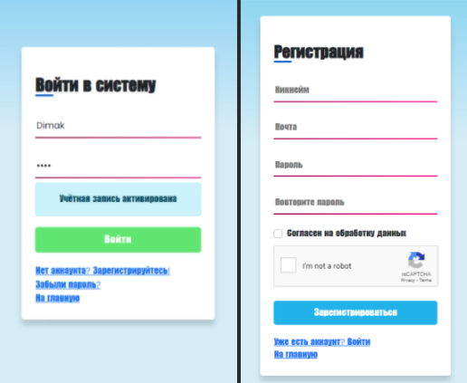
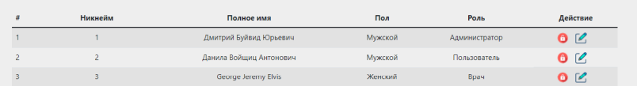

# *Medical data analyzer*

---
### *Description*
This web-app has convenient and intuitive interface. 
App helps to storage and analyze incoming medical data (analyzes) and gets back result of them. 
Moreover, it helps and doctor to control patients health parameters and warning them if it needs.
***

### *Used tools*

***
Technologies:
*Spring Boot, Spring Security, Hibernate, Thymeleaf, JQuery, Bootstrap, Ajax, Fetch API, Mockito, Junit, Slf4j,
Lombok, Jackson, Flyway, html/css/js.*

### *Database schema*

---

### *Use cases (Possibilities)*

---
#### General:
- authorization
- i18n (RU, EN);
- pagination
- password recover (via email)
#### Admin:
- registration (via email)
- registration of surveillance services
- formation of the history of analyzes
- formation of biochemical analyzes
- formation of general analyzes
- analysis of medical indicators
- filling out analyzes
- getting doctor's advice
- profiling
- google captcha
- correction of information
#### User:
- block/unblock users
- change of access rights
- adjusting user information
- creating an authorization report
- screenshot generation
- statistic of app usage 
- upload profile photo

#### Doctor:
- making recommendations to the patient
- monitoring of medical indicators

### *Some screenshots*

---

### *Development log*

---
    Developed abstract dao, connection pool, services, login/main pages and etc...
    before...

    21/02/2022 - i18n implementation
    22/02/2022 - Replaced c3p0 on HikariCP
    23/02/2022 - Thymeleaf implementation
    02/03/2022 - Design login and registration pages, abstract dao, services 
    04/03/2022 - Redesign pages, added controllers
    07/03/2022 - Form validation (front-end)
    08/03/2022 - Form validation (back-end)
    08/03/2022 - Developed personal, edit data pages; logs
    12/03/2022 - User managment page
    13/03/2022 - Injected jquery, replaced synchronic request on asynch via ajax
    14/03/2022 - Implemeted activity chart via highcharts.com
    17/03/2022 - Form validation (back/front-end)
    19/03/2022 - Analyzes page
    22/03/2022 - Pagination, replace Ajax on Fetch API
    25/03/2022 - Addded i18n data, deleted useless elements
---
